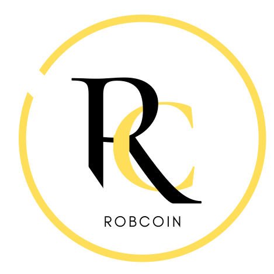
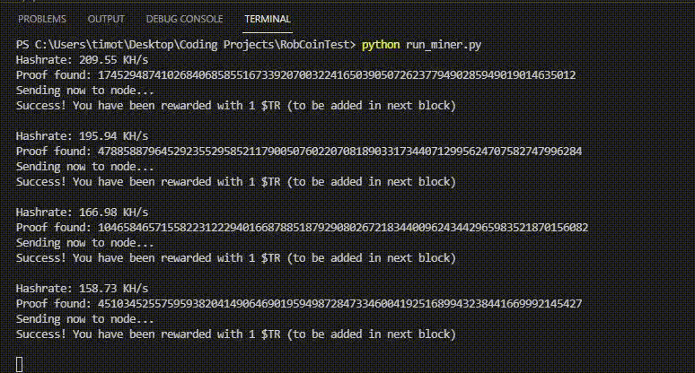
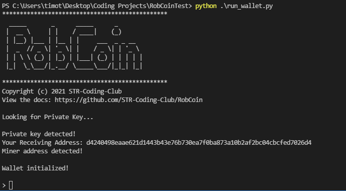

<!-- PROJECT LOGO -->
<br />
<p align="center">
  <a href="https://github.com/STR-Coding-Club/RobCoin">
    
  </a>

  <h3 align="center">STR Robcoin</h3>

  <p align="center">
    A Proof of Work Cryptocurrency Written in Python
    <br />
    <a href="https://github.com/STR-Coding-Club/RobCoin#table-of-contents"><strong>Explore the docs »</strong></a>
    <br />
    <br />
    <a href="https://github.com/STR-Coding-Club/RobCoin#initialization">View Demo</a>
    ·
    <a href="https://github.com/STR-Coding-Club/RobCoin/issues">Report Bug</a>
    ·
    <a href="https://github.com/STR-Coding-Club/RobCoin/issues">Request Feature</a>
  </p>
</p>


<!-- TABLE OF CONTENTS -->
<details open="open">
  <summary><h2 style="display: inline-block">Table of Contents</h2></summary>
  <ol>
    <li>
      <a href="#about-the-project">About The Project</a>
      <ul>
        <li><a href="#disclaimer">DISCLAIMER</a></li>
        <li><a href="#built-with">Built With</a></li>
      </ul>
    </li>
    <li><a href="#usage">Usage</a>
      <ul>
        <li><a href="#prerequisites">Prerequisites</a></li>
        <li><a href="#initialization">Initialization</a></li>
        <li><a href="#wallet-transactions">Wallet</a></li>
      </ul>
    </li>  
    <li>
      <a href="#forking">Forking</a>
      <ul>
        <li><a href="#prerequisites-1">Prerequisites</a></li>
        <li><a href="#installation">Installation</a></li>
      </ul>
    </li>
    <li><a href="#contributing">Contributing</a></li>
    <li><a href="#license">License</a></li>
    <li><a href="#contact">Contact</a></li>
    <li><a href="#acknowledgements">Acknowledgements</a></li>
  </ol>
</details>


<!-- ABOUT THE PROJECT -->
## About The Project


Developed by St. Robert CHS' Coding Club in 2021, RobCoin (Symbol: $TR) is a proof-of-work cryptocurrency written in Python. As a project, RobCoin's development was used to guide and educate club members about cryptocurrencies and provide real-world programming experience.

### DISCLAIMER

AS A PROJECT DESIGNED AROUND EDUCATION, ROBCOIN HAS NO MONETARY VALUE. THE USE OF THIS COIN SHOULD ONLY BE FOR EDUCATIVE/EXPLORATORY PURPOSES. ST. ROBERT CHS CODING CLUB HIGHLY DISCOURAGES THE USE OF ROBCOIN AS A MEDIUM OF TRANSACTION FOR MATTERS SUCH AS, BUT NOT LIMITED TO: (1)TRANSACTIONS OF MONETARY VALUE, (2)EXCHANGE FOR SERVICES AND/OR GOODS, (3)ILLEGAL/ILLICIT ACTIVITIES. ANY EVIDENCE OF SUCH ACTION WILL BE REPRIMANDED. ROBCOIN'S SOURCE CODE IS DISTRIBUTED UNDER THE MIT LICENSE. SEE `LICENSE` FOR MORE INFORMATION.

### Built With

* [Python 3.9](https://www.python.org/)
* [Flask 2.0.0](https://pypi.org/project/Flask/)
* [Cryptography 3.4.7](https://pypi.org/project/cryptography/)


<!-- USAGE EXAMPLES -->
## Usage

### Prerequisites

* Python `3.9`, `pip3`


#### Windows
1. Install the latest release of Python `3.9`
    * https://www.python.org/downloads/

#### Ubuntu
1. Update before installing new packages

   ```sh
   sudo apt-get update
   ```
2. Check Python version

   ```sh
   python3 --version
   ```
3. If Python version < `3.9`

   ```sh
   sudo apt install python3.9
   ```
4. Validate

   ```sh
   python3.9 --version
   ```
5. Install `pip3`

   ```sh
   sudo apt-get -y install python3-pip
   ```
6. Validate

   ```sh
   pip3 --version
   ```

### Initialization

Download and extract `client.zip` (**NOT THE SOURCE CODE!**) from the latest `release`. 
    
   * Download here: [https://github.com/STR-Coding-Club/RobCoin/releases](https://github.com/STR-Coding-Club/RobCoin/releases)

1. Install Required Libraries
   ```sh
   pip3 install -r requirements.txt
   ```

   In some cases, **pip3** may be **pip** in `PATH`
   ```sh
   pip install -r requirements.txt
   ```
2. Using your IDE of choice, open the extracted `RobCoin` folder.
3. Run `run_wallet.py` to generate private & public keys; wallet address.
4. Run `run_miner.py` to start mining to earn RobCoin!



### Wallet (Transactions)
After mining for a while, you should have some RobCoin to spend! `run_wallet.py` will allow you to send, recieve and check your balance through the use of commands.




#### Commands

1. `address`

    - Returns your receiving address so that others can send you Robcoin

2. `balance`

    - Returns your balance of Robcoin.
      
      * `Pending` refers to transactions that have yet to be mined onto the blockchain.

3. `balance <address>`

    - Returns the balance of inputted address

4. `send <recipient> <amount>`

    - recipient -> The recipient's address

    - amount -> The amount of Robcoin you wish to send


<!-- Forking -->
## Forking

Using RobCoin's source code, you may choose to fork RobCoin by creating your own blockchain. To do so, you will need to run your own `node`

### Prerequisites

* Python `3.9`, `pip3`

1. Update before installing new packages

   ```sh
   sudo apt-get update
   ```
2. Check Python version

   ```sh
   python3 --version
   ```
3. If Python version < `3.9`

   ```sh
   sudo apt install python3.9
   ```
4. Validate

   ```sh
   python3.9 --version
   ```
5. Install `pip3`

   ```sh
   sudo apt-get -y install python3-pip
   ```
6. Validate

   ```sh
   pip3 --version
   ```

### Installation

1. Clone the repo
   ```sh
   git clone https://github.com/STR-Coding-Club/RobCoin
   ```
2. `cd` into repo directory
   ```sh
   cd RobCoin
   ```
3. Install Required Libraries
   ```sh
   pip3 install -r requirements.txt
   ```
4. Open Port `5000` on host domain
5. Add host domain to `wallet.py`, `node.py`
6. Run `node.py`
   ```sh
   python3 node.py
   ```


<!-- CONTRIBUTING -->
## Contributing

Contributions are what make the open source community such an amazing place to be learn, inspire, and create. Any contributions you make are **greatly appreciated**.

1. Fork the Project
2. Create your Feature Branch (`git checkout -b feature/AmazingFeature`)
3. Commit your Changes (`git commit -m 'Add some AmazingFeature'`)
4. Push to the Branch (`git push origin feature/AmazingFeature`)
5. Open a Pull Request


<!-- LICENSE -->
## License

Distributed under the MIT License. See `LICENSE` for more information.


<!-- CONTACT -->
## Contact

St. Robert CHS Coding Club - [@strcodingclub](https://www.instagram.com/strcodingclub/) - str.codingclub@gmail.com

Project Link: [https://github.com/STR-Coding-Club/RobCoin](https://github.com/STR-Coding-Club/RobCoin)


<!-- ACKNOWLEDGEMENTS -->
## Acknowledgements

* [*"Learn Blockchains by Building One"* by Daniel van Flymen](https://hackernoon.com/learn-blockchains-by-building-one-117428612f46)
